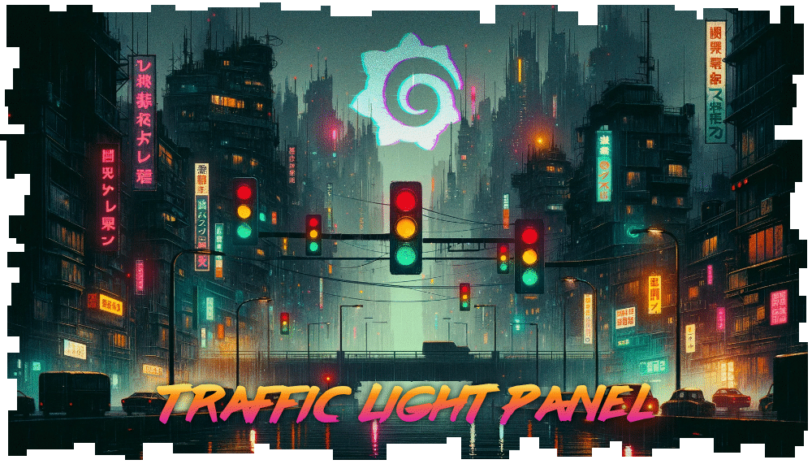

<p align="center">

</p>

<h1 align="center">Grafana Traffic Light Panel Plugin</h1>

Like a Gauge only more colourful! 🚦

## Usage

See [this readme](./src/README.md) for usage.

## Contributing

Got ideas or feedback? Your contributions help make this plugin better. Share your thoughts and code improvements on GitHub.

## Creating PRs

1. Clone the repository
2. Create a dev branch

3. Install dependencies

   ```bash
   npm install
   ```

4. Build plugin in development mode and run in watch mode

   ```bash
   npm run dev
   ```

5. Build plugin in production mode

   ```bash
   npm run build
   ```

6. Run the tests (using Jest)

   ```bash
   # Runs the tests and watches for changes, requires git init first
   npm run test

   # Exits after running all the tests
   npm run test:ci
   ```

7. Spin up a Grafana instance and run the plugin inside it (using Docker)

   ```bash
   npm run server
   ```

8. Run the E2E tests (using Cypress)

   ```bash
   # Spins up a Grafana instance first that we test against
   npm run server

   # Starts the tests
   npm run e2e
   ```

9. Run the linter

   ```bash
   npm run lint

   # or

   npm run lint:fix
   ```

## License

This plugin is licensed under the Apache-2.0 license.
